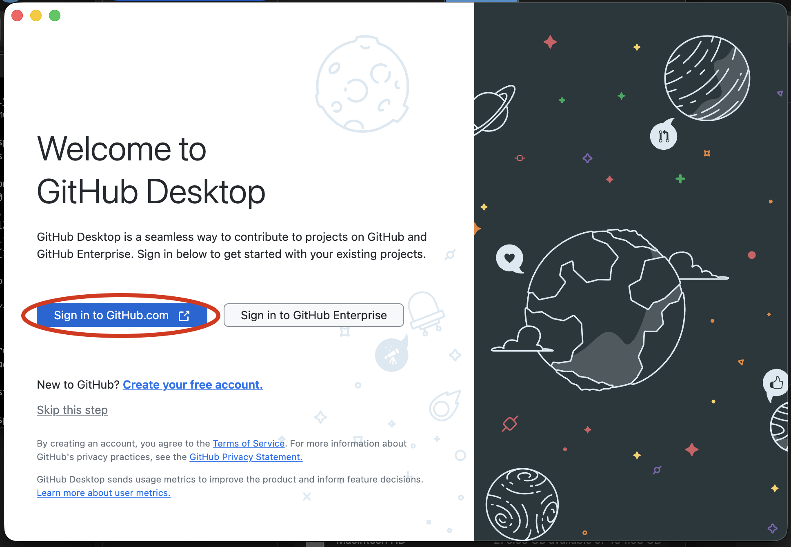
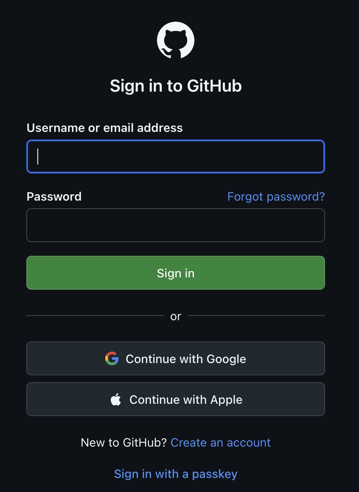
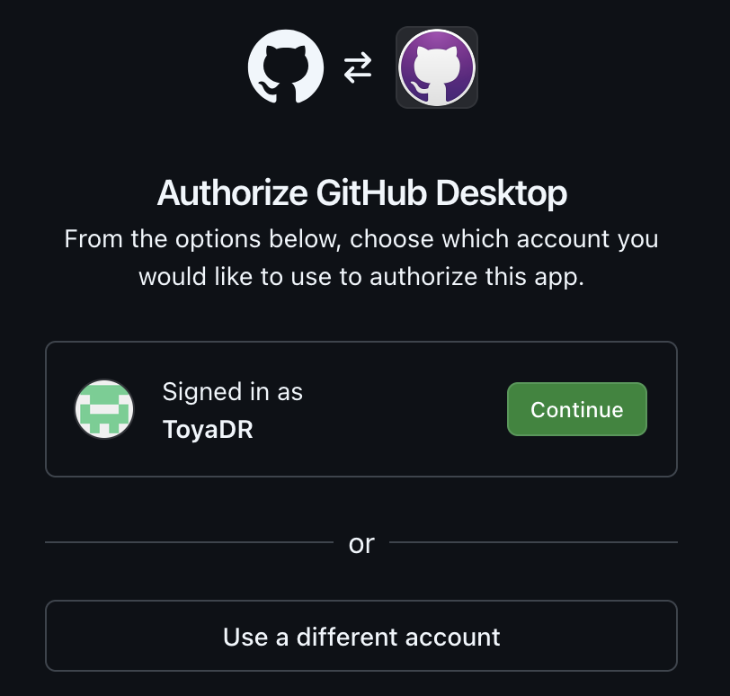
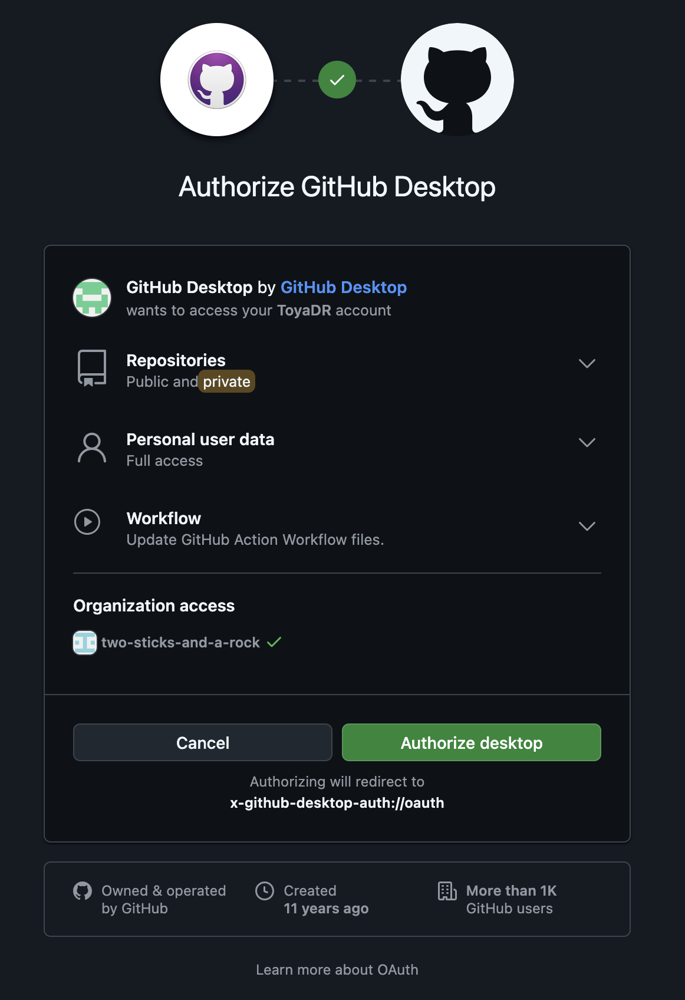
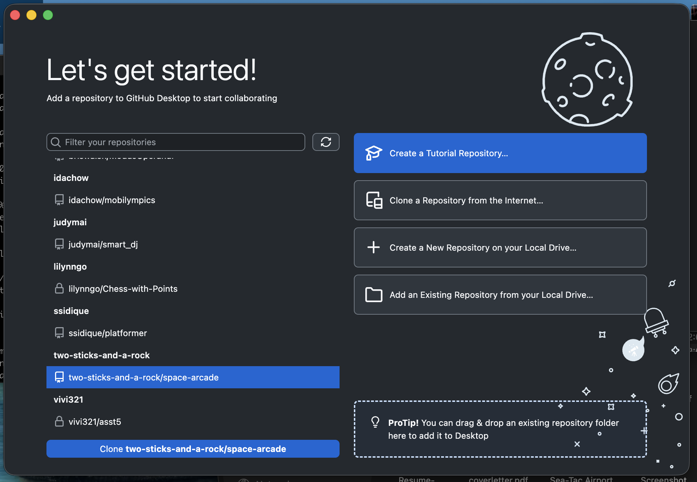
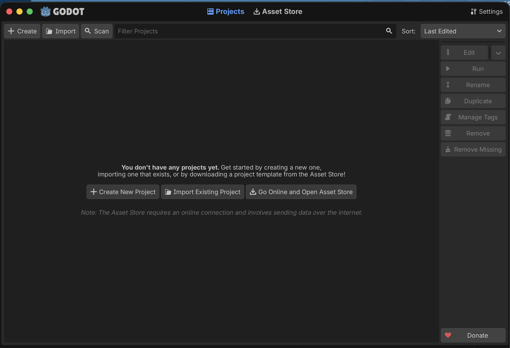

# space-arcade
Pilot a spaceship in a 2D bullet heaven

# Setup for Development

## Download the Godot Game Engine
This project is written in **GDScript** using **Godot 4**. 
~~Our latest build used [Godot 4.7.2-stable](https://godotengine.org/download/archive/4.7.2-stable/).~~ (we do not currently have a build @ToyaDR keep this updated)

Places to download Godot:
- [Official Godot site](https://godotengine.itch.io/godot)
- [itch.io](https://godotengine.itch.io/godot)
- [Steam](https://store.steampowered.com/app/404790/Godot_Engine/?curator_clanid=41324400)
- [Epic Games](https://store.epicgames.com/p/godot-engine)

## Get the actual project

### Option A) Github Desktop

For setup instructions via Github CLI, go [here](#option-b-github-cli)

**1. Download Github Desktop**

[Github Desktop downloads](https://desktop.github.com/download/)

Note: for Mac users, you may have to allow downloads from anywhere before your machine will allow this download.

**2. Open the file that was downloaded.**

This will install Github Desktop to your computer.

**3. Sign into Github via Github Desktop**

Open up Github Desktop and sign in using your Github account. Click on the button that says "Sign in to Github.com".

<p style="text-align:center">

</p>

This will open a new tab in your default browser.

If you aren't signed in, you should get this window:
<p style="text-align:center">

</p>

Log in (or if you were already logged in) and you should get this window:
<p style="text-align:center">

</p>
Click "Continue" to be redirected to an authorization window:

<p style="text-align:center">

</p>

These are the permissions you will be granting Github Desktop by authorizing it. If you are ok with this then click "Authorize desktop."

You will get redirected back to Github Desktop where you have successfully signed in.

**4. Clone the Repo**

Select two-sticks-and-a-rock/space-arcade from the list of repos you have permission to clone. Click the "Clone two-sticks-and-a-rock/space-arcade" button.


This should clone the repo and get you a local copy of the project's source code.

### Option B) Github CLI
For setup instructions via Github Desktop (which has a GUI), go [here](#option-a-github-desktop).

**1. Download Github CLI**

[See Github's installation documentation](https://github.com/cli/cli?ref_product=cli&ref_type=engagement&ref_style=text#installation)

**2. Log in via Github CLI**

```
gh auth login
```

See [Github CLI's Quickstart guide](https://docs.github.com/en/github-cli/github-cli/quickstart) if you run into any issues.

**3. Clone the repo**

```
gh repo clone two-sticks-and-a-rock/space-arcade 
```

## Open the project in Godot
Open up the Godot engine.
<p style="text-align:center">

</p>

Click either "Import" or "Import Existing Project" and select `space-arcade` from your files.
